# 🌱 Paragon Systematic Neural Growth Engine

This project demonstrates **systematic neural network growth using ADHD-based evaluation** on the MNIST dataset, powered by the [Paragon](https://github.com/openfluke/paragon) AI framework.

The system **systematically discovers and tests layer suggestions** across all possible checkpoint layers, evaluating each candidate on the full dataset using ADHD confidence scoring, and accepting the first improvement that enhances either training or test performance.

## 🚀 Overview

- **Framework**: [Paragon](https://github.com/openfluke/paragon) (modular neural substrate in Go with WebGPU support)
- **Dataset**: MNIST handwritten digits (limited to 1000 train, 200 test for rapid experimentation)
- **Objective**: Systematically grow networks by inserting 32×32 layers at optimal locations
- **Scoring**: ADHD Score — confidence-weighted accuracy evaluation
- **Growth Strategy**: Two-phase approach for robust layer discovery and validation

## Systematic Growth Engine Flowchart

```mermaid
flowchart TD
    A[🚀 Start Systematic Growth Engine] --> B[📊 Load MNIST Dataset]
    B --> C[🔧 Limit Dataset Size<br/>Train: 500, Test: 100]
    C --> D[🧠 Create Initial Network<br/>28×28 → 32×32 → 10×1]
    D --> E[💾 Disable WebGPU<br/>Reduce Memory Usage]
    E --> F[📝 Initialize Growth Log]
    F --> G[📊 Initial ADHD Evaluation<br/>Train & Test Scores]
    G --> H[🌱 Start Growth Attempt Loop<br/>attempt = 1]

    H --> I{attempt ≤ 25?}
    I -->|No| Z1[🏁 Final Results]
    I -->|Yes| J[🧠 Print Memory Usage]

    J --> K[📊 Get Baseline Scores<br/>Train & Test ADHD]
    K --> L[🎯 Initialize Best Suggestion<br/>Tracker = empty]
    L --> M[🔍 Start Checkpoint Loop<br/>checkpoint = 1]

    M --> N{checkpoint < layers-1?}
    N -->|No| W[🏆 Evaluate Best Suggestion]
    N -->|Yes| O[📦 Prepare Training Batch<br/>16 samples]

    O --> P[🔄 Clone Network Copy]
    P --> Q[🧬 Run Grow Function<br/>See detailed subgraph below]
    Q --> R{Layer Found by Grow?}

    R -->|No| S[😞 Log Failed Attempt<br/>Clean up copy]
    R -->|Yes| T[✅ Evaluate on Full Dataset<br/>Train & Test ADHD]

    T --> U[📏 Calculate Improvements<br/>vs Baseline]
    U --> V{Better than current best?}

    V -->|No| S
    V -->|Yes| X[🏆 Update Best Suggestion<br/>Store network copy]

    S --> Y[checkpoint++]
    X --> Y
    Y --> N

    W -->     AA{Best suggestion found & acceptable?}
    AA -->|No| BB[⚠️ Log Failed Attempt<br/>No growth found]
    AA -->|Yes| CC[✅ Accept Best Suggestion<br/>Replace main network]

    CC --> DD[📝 Log Successful Growth<br/>Update growth counter]
    DD --> EE[🧠 Print Updated Network<br/>Structure]

    BB --> FF[🔧 Adaptive Batch Size<br/>Reduce if needed]
    EE --> FF

    FF --> GG{Growth count ≥ 6?}
    GG -->|Yes| Z1
    GG -->|No| HH{attempt % 3 = 0?}

    HH -->|Yes| II[🗑️ Force Garbage Collection<br/>Free Memory]
    HH -->|No| JJ[attempt++]

    II --> JJ
    JJ --> I

    Z1 --> Z2[📊 Final Network Evaluation<br/>Train & Test ADHD]
    Z2 --> Z3[📄 Save Growth Log<br/>Complete Analysis]
    Z3 --> Z4[🎉 End Process]

    %% GROW FUNCTION DETAILED FLOW
    subgraph GROW ["🧬 Grow Function Detailed Process"]
        G1[🎯 Calculate Batch Baseline - Accuracy on 16 samples]
        G2[🧠 Extract Checkpoint Activations - Forward pass → save layer state]
        G3[👥 Start Worker Threads - Max 4 parallel workers]

        %% Worker Thread Process
        G4[🔄 Clone Network for Worker]
        G5[✂️ Extract Micro-Network<br/>Checkpoint → Output only]
        G6[🔧 Try Improvement<br/>Add 32×32 hidden layer]
        G7[🎓 Train Micro-Network<br/>2 epochs on checkpoints]
        G8[📊 Evaluate Micro Performance<br/>ADHD on checkpoints]
        G9[📤 Send Result to Channel]

        G10[🏆 Collect All Results<br/>From worker channels]
        G11[🔍 Select Best Candidate<br/>Highest micro score]
        G12{Best > Baseline + threshold?}
        G13[🔗 Reattach to Full Network<br/>Network Surgery]
        G14[📊 Evaluate Full Network<br/>On original batch]
        G15{Full Network Better?}
        G16[✅ Return True<br/>Growth Successful]
        G17[❌ Return False<br/>No Improvement]

        G1 --> G2 --> G3
        G3 --> G4 --> G5 --> G6 --> G7 --> G8 --> G9
        G9 --> G10 --> G11 --> G12
        G12 -->|Yes| G13 --> G14 --> G15
        G12 -->|No| G17
        G15 -->|Yes| G16
        G15 -->|No| G17
    end

    %% MICRO-NETWORK SURGERY DETAIL
    subgraph SURGERY ["✂️ Micro-Network Surgery Process"]
        S1[🎯 Create 2-Layer Micro - Checkpoint → Output]
        S2[📋 Copy Weights - From original network]
        S3[🆕 Try Adding Layer - Checkpoint → 32×32 → Output]
        S4[🔧 Generate Random Dimensions - Width: 32, Height: 32]
        S5[🎭 Random Activation Function - relu, tanh, leaky_relu, etc.]
        S6[⚖️ Adapt Output Weights - Preserve learned patterns]
        S7[🎓 Train New Micro-Network - 2 epochs, 0.01 learning rate]
        S8[📊 Score: Max Confidence - Across output neurons]
        S9{Improved > Current?}
        S10[✅ Keep Improvement]
        S11[❌ Keep Original]

        S1 --> S2 --> S3 --> S4 --> S5 --> S6 --> S7 --> S8 --> S9
        S9 -->|Yes| S10
        S9 -->|No| S11
    end

    %% REATTACHMENT PROCESS
    subgraph REATTACH ["🔗 Network Reattachment Process"]
        R1[🔍 Detect Layer Structure<br/>2-layer vs 3-layer micro]
        R2{Micro has 3 layers?}
        R3[➕ Insert New Layer<br/>After checkpoint]
        R4[📋 Copy Checkpoint→Hidden<br/>Weights from micro]
        R5[📋 Copy Hidden→Output<br/>Weights from micro]
        R6[🔄 Update Layer Indices<br/>Shift output layer]
        R7[✅ Surgery Complete<br/>Network updated]
        R8[📋 Copy Updated Weights<br/>Checkpoint→Output only]

        R1 --> R2
        R2 -->|Yes| R3 --> R4 --> R5 --> R6 --> R7
        R2 -->|No| R8 --> R7
    end

    %% ADHD SCORING PROCESS
    subgraph ADHD ["🎯 ADHD Scoring Process"]
        ADHD1[🔄 Forward Pass on Dataset]
        ADHD2[🔢 Compare Expected vs Actual - ArgMax of output vectors]
        ADHD3[📊 Calculate Deviation - absolute difference divided by expected times 100]
        ADHD4[🗂️ Categorize into Buckets - 0-10%, 10-20%, 20-30%, etc.]
        ADHD5[💯 Score Each Prediction - max of 0 and 100 minus deviation]
        ADHD6[📈 Average Across Samples - Total score divided by sample count]
        ADHD1 --> ADHD2 --> ADHD3 --> ADHD4 --> ADHD5 --> ADHD6
    end

    %% PARALLEL WORKER DETAIL
    subgraph WORKERS ["👥 Parallel Worker Threads"]
        W1[🧵 Worker Thread 1 - 10 candidates]
        W2[🧵 Worker Thread 2 - 10 candidates]
        W3[🧵 Worker Thread 3 - 10 candidates]
        W4[🧵 Worker Thread 4 - 10 candidates]
        WC[📦 Results Channel - Thread-safe collection]

        W1 --> WC
        W2 --> WC
        W3 --> WC
        W4 --> WC
    end

    %% DECISION CRITERIA
    subgraph DECISION ["✅ Acceptance Criteria"]
        DEC1[🎯 Batch Improvement - Grow function finds better micro]
        DEC2[📊 Full Dataset Test - Train >1.0 OR Test >1.0]
        DEC3[🏆 Best of All Checkpoints - Highest combined score]
        DEC1 --> DEC2 --> DEC3
    end

    %% MEMORY OPTIMIZATION
    subgraph MEMORY ["💾 Memory Optimizations"]
        MEM1[📊 Small Dataset: 500/100]
        MEM2[🚫 No WebGPU Memory]
        MEM3[🗑️ Immediate Cleanup]
        MEM4[🧵 Limited Threads: ≤4]
        MEM5[⚙️ Reduced Parameters<br/>10 candidates, 2 epochs]
        MEM6[♻️ Forced GC Every 3 Attempts]
        MEM7[📦 Single Best Tracking<br/>No suggestion arrays]
    end

    %% Connect Grow function to detailed subgraph
    Q -.-> G1

    %% Styling
    classDef startEnd fill:#1565c0,stroke:#0d47a1,stroke-width:3px,color:#ffffff
    classDef process fill:#6a1b9a,stroke:#4a148c,stroke-width:2px,color:#ffffff
    classDef decision fill:#ef6c00,stroke:#e65100,stroke-width:2px,color:#ffffff
    classDef memory fill:#2e7d32,stroke:#1b5e20,stroke-width:2px,color:#ffffff
    classDef success fill:#388e3c,stroke:#2e7d32,stroke-width:2px,color:#ffffff
    classDef failure fill:#d32f2f,stroke:#c62828,stroke-width:2px,color:#ffffff
    classDef grow fill:#558b2f,stroke:#33691e,stroke-width:2px,color:#ffffff
    classDef surgery fill:#ad1457,stroke:#880e4f,stroke-width:2px,color:#ffffff
    classDef parallel fill:#1976d2,stroke:#0d47a1,stroke-width:2px,color:#ffffff

    class A,Z4 startEnd
    class B,C,D,E,F,G,K,L,O,P,T,U,DD,EE,Z1,Z2,Z3 process
    class I,N,R,V,AA,GG,HH decision
    class J,II memory
    class CC,X success
    class S,BB failure
    class G1,G2,G3,G4,G5,G6,G7,G8,G9,G10,G11,G13,G14,G16,G17 grow
    class G12,G15 decision
    class S1,S2,S3,S4,S5,S6,S7,S8,S10,S11 surgery
    class S9 decision
    class R1,R2,R3,R4,R5,R6,R7,R8 surgery
    class W1,W2,W3,W4,WC parallel
```



## 🧠 Systematic Growth Process

### **Phase 1: Layer Discovery**

```
🔍 Collecting layer suggestions from all checkpoint layers...
🎯 Trying checkpoint layer 1... ✅ Found 32x32 layer (relu)
🎯 Trying checkpoint layer 2... 😞 No improvement found
🎯 Trying checkpoint layer 3... ✅ Found 32x32 layer (tanh)
📊 Found 2 layer suggestions, testing each on full network...
```

### **Phase 2: Systematic Validation**

```
🧪 Testing suggestion 1/2: Checkpoint 1 → Layer 2 (32x32, relu)
📊 TRAIN: 63.15 → 60.52 (-2.63) | TEST: 59.99 → 55.27 (-4.73)
❌ REJECTING SUGGESTION 1

🧪 Testing suggestion 2/2: Checkpoint 3 → Layer 4 (32x32, tanh)
📊 TRAIN: 63.15 → 60.59 (-2.56) | TEST: 59.99 → 61.99 (+2.00)
✅ ACCEPTING SUGGESTION 2! (Test ADHD improved +2.00)
```

## ⚙️ Configuration

| Parameter               | Value                                | Description                         |
| ----------------------- | ------------------------------------ | ----------------------------------- |
| **Layer Size**          | 32×32                                | Fixed dimensions for all new layers |
| **Acceptance Criteria** | Train >+1.0 OR Test >+1.0            | ADHD score improvement threshold    |
| **Activations**         | relu, tanh, leaky_relu, sigmoid, elu | Randomly selected per layer         |
| **Batch Size**          | 32 → 16 (adaptive)                   | Reduces after failed attempts       |
| **Max Attempts**        | 50                                   | Total growth iterations             |
| **Successful Growths**  | Early stop at 8                      | Prevents over-growth                |

## 🛠 Usage

Clone the repo and run the systematic growth engine:

```bash
go run .
```

**Example output:**

```
🌱 Successful 32x32 layer growths: 4
🧠 Final Network Structure:
  Layer 0: 28x28 (linear)   # Input
  Layer 1: 32x32 (relu)     # Initial hidden
  Layer 2: 32x32 (leaky_relu) # ← Growth #1
  Layer 3: 32x32 (leaky_relu) # ← Growth #2
  Layer 4: 32x32 (leaky_relu) # ← Growth #3
  Layer 5: 32x32 (leaky_relu) # ← Growth #4
  Layer 6: 10x1 (softmax)   # Output

📊 ADHD Performance: 40.81 → 66.73 (+25.92)
```

## 📊 Growth Logging

The system creates `neural_network_growth.log` with detailed tracking:

```
Attempt | Checkpoint | Train_Before | Train_After | Test_Before | Test_After | Accepted
1       | 1          | 40.8100      | 63.1505     | 38.5298     | 59.9960    | YES
2       | 1          | 63.1505      | 60.5178     | 59.9960     | 55.2687    | NO
2       | 2          | 63.1505      | 61.6314     | 59.9960     | 60.0232    | NO
3       | 2          | 63.1505      | 60.5867     | 59.9960     | 61.9990    | YES
```

## 🔬 Key Components

| Component                   | Description                                              |
| --------------------------- | -------------------------------------------------------- |
| **`Grow()`**                | Discovers potential layer candidates using small batches |
| **`LayerSuggestion`**       | Stores network copies with proposed 32×32 layers         |
| **`evaluateFullNetwork()`** | Computes ADHD scores on complete datasets                |
| **`cloneNetwork()`**        | Creates independent network copies for testing           |
| **`getNewLayerInfo()`**     | Extracts details about discovered layers                 |

## 🧪 ADHD Evaluation Metrics

The system uses **Accuracy Deviation Heatmap Distribution (ADHD)** scoring:

- **High Confidence Correct** (0-10% deviation): +90-100 points
- **Medium Confidence** (10-50% deviation): +50-90 points
- **Low Confidence** (50-100% deviation): +0-50 points
- **Wrong Predictions** (100%+ deviation): 0 points

**Acceptance Logic:**

```go
trainGood := trainImprovement > 1.0    // ADHD points
testGood := testImprovement > 1.0      // ADHD points
accepted := trainGood || testGood      // Either dataset
```

## 📈 Performance Results

Based on the example run:

- **Initial**: 3 layers, Train: 40.81, Test: 38.53
- **Growth #1**: +22.34 train, +21.47 test improvement
- **Growth #2**: -2.56 train, +2.00 test (test improvement accepted)
- **Growth #3**: +5.49 train, +0.14 test improvement
- **Growth #4**: +0.65 train, +6.15 test improvement
- **Final**: 7 layers, Train: 66.73, Test: 68.29

## 🚀 Advanced Features

- **WebGPU Acceleration**: Automatically leverages GPU when available
- **Adaptive Batching**: Reduces batch size after failed attempts
- **Thread Safety**: Concurrent candidate evaluation with worker pools
- **Comprehensive Logging**: Timestamped growth history with ADHD metrics
- **Network Surgery**: Safe layer insertion and weight adaptation

## 🧬 Growth Philosophy

This approach mimics **biological neural development**:

1. **Exploration**: Test multiple growth sites simultaneously
2. **Competition**: Evaluate all candidates before selection
3. **Validation**: Confirm improvements on full datasets
4. **Integration**: Surgically attach successful structures
5. **Adaptation**: Adjust strategy based on success patterns

## 📦 Dependencies

- Go 1.21+
- [Paragon v3](https://github.com/openfluke/paragon) neural framework
- WebGPU bindings (optional, for GPU acceleration)
- MNIST dataset (auto-downloaded to `./data/mnist/`)

## 🌍 Future Directions

- **Variable Layer Sizes**: Beyond fixed 32×32 dimensions
- **Multi-Objective Growth**: Balancing accuracy, efficiency, and robustness
- **Evolutionary Strategies**: Population-based layer evolution
- **Transfer Learning**: Apply growth patterns across datasets
- **Real-Time Adaptation**: Dynamic growth during training

---

Built with 🧠 by [@openfluke](https://github.com/openfluke) — **systematically growing intelligence, one layer at a time.**
